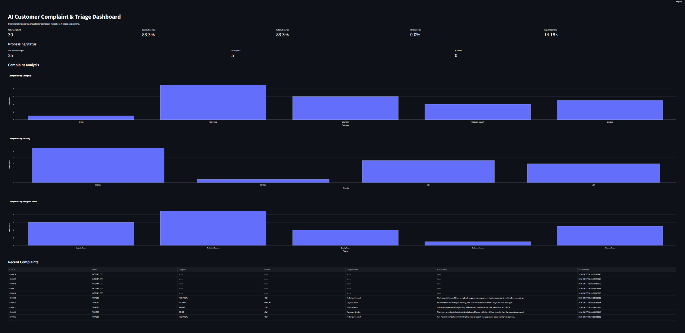
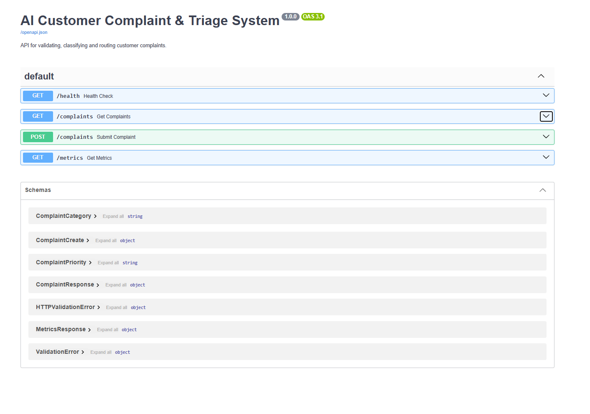

# AI Customer Complaint & Triage System

An end-to-end AI-assisted complaint handling system that validates incoming customer complaints, uses a local LLM to classify and prioritize complete cases, routes them to the appropriate business team, stores structured results in PostgreSQL, and exposes operational KPIs through a Streamlit dashboard.

The project demonstrates how AI can be integrated into an operational business process while keeping validation, routing logic, persistence, monitoring, and failure handling deterministic and testable.

## Business Problem

Customer complaints often require several manual triage steps before investigation can begin:

1. Check whether all required information is present.
2. Read and understand the complaint.
3. Summarize the issue.
4. Categorize the complaint.
5. Determine its urgency.
6. Identify the responsible department.
7. Forward the case for investigation.

This creates repetitive administrative work and can introduce inconsistent categorization and routing.

This project automates the initial triage process while keeping the final investigation with the responsible business team.

## Solution

The system processes each complaint through the following pipeline:

```text
Complaint Submission
        |
        v
Field Validation
        |
        +---- Incomplete ----> Store as INCOMPLETE
        |
        v
Local LLM Triage
        |
        +---- Failure -------> Store as AI_FAILED
        |
        v
Structured Classification
  - Category
  - Priority
  - Summary
        |
        v
Deterministic Routing
        |
        v
PostgreSQL
        |
        v
FastAPI / Streamlit Dashboard
```

The LLM is responsible for understanding and summarizing the complaint, while team assignment is performed using deterministic application logic rather than allowing the model to freely choose a destination.

## Technology Stack

- **Python**
- **FastAPI** — REST API
- **Pydantic** — request and structured LLM-output validation
- **Ollama + Qwen3 4B** — local complaint classification and summarization
- **PostgreSQL** — persistent complaint storage
- **SQLAlchemy** — database access
- **Docker** — PostgreSQL environment
- **Streamlit** — operational dashboard
- **Plotly** — KPI visualizations
- **Pandas** — dataset and dashboard processing
- **Pytest** — automated testing

## Complaint Classification

Complete complaints are classified into one of five categories:

| Category | Description |
|---|---|
| `TECHNICAL` | Software, firmware, connectivity, configuration or functional technical issues |
| `PRODUCT_QUALITY` | Physical defects, damage or manufacturing-quality issues |
| `DELIVERY` | Late, missing or incorrect shipments |
| `BILLING` | Invoice, charge, payment or billing issues |
| `OTHER` | Complaints outside the predefined categories |

The model also assigns a priority:

`LOW` → `MEDIUM` → `HIGH` → `CRITICAL`

and produces a short factual summary.

## Deterministic Routing

Routing is deliberately separated from the LLM:

| Category | Assigned Team |
|---|---|
| `TECHNICAL` | Technical Support |
| `PRODUCT_QUALITY` | Quality Team |
| `DELIVERY` | Logistics Team |
| `BILLING` | Finance Team |
| `OTHER` | Customer Service |

This makes routing predictable, auditable, and easy to test.

## Operational Safeguards

The pipeline handles several failure conditions explicitly:

- Missing mandatory fields are detected before AI processing.
- Incomplete complaints are stored with an `INCOMPLETE` status.
- LLM output is validated against a Pydantic schema.
- Invalid or failed AI processing is handled using an `AI_FAILED` status.
- Team routing is deterministic and independent of model generation.
- Database persistence keeps an operational record of processed cases.
- Dashboard/API responses avoid exposing unnecessary customer information.

## Dashboard

The Streamlit dashboard provides operational monitoring for the complaint process, including:

- Total complaints
- Completion rate
- Automation rate
- AI failure rate
- Average automated triage time
- Complaints by category
- Complaints by priority
- Complaints by assigned team
- Recent complaint results

## Synthetic Evaluation Dataset

The project includes a synthetic dataset of **30 customer complaints** designed to exercise the complete workflow.

- **25 complete complaints**
- **5 deliberately incomplete complaints**

On the current synthetic run:

| KPI | Result |
|---|---:|
| Total complaints | 30 |
| Successfully triaged | 25 |
| Incomplete complaints | 5 |
| AI failures | 0 |
| Completion rate | 83.3% |
| Automation rate | 83.3% |
| Average automated triage time | 14.18 s |
| Fastest automated triage | 6.99 s |
| Slowest automated triage | 25.25 s |

Processing-time measurements were collected locally using Qwen3 4B and therefore depend on the hardware and local model runtime.

These results demonstrate the technical workflow on synthetic data and should not be interpreted as production performance benchmarks.

## Process Improvement

### Manual Process

```text
Complaint Received
        ↓
Check Required Information
        ↓
Read Complaint
        ↓
Summarize Issue
        ↓
Determine Category
        ↓
Assess Priority
        ↓
Choose Responsible Team
        ↓
Forward Complaint
        ↓
Investigation
```

### AI-Assisted Process

```text
Complaint Received
        ↓
Automatic Validation
        ↓
AI Classification + Summary + Priority
        ↓
Deterministic Routing
        ↓
Structured Database Record
        ↓
Responsible Team
        ↓
Investigation
```

The system automates the repetitive triage activities while preserving deterministic business routing and explicit exception handling.

Detailed Mermaid process diagrams are available in [`docs/process_flow.md`](docs/process_flow.md).

## Project Structure

```text
ai-complaint-triage/
├── app/
│   ├── main.py
│   ├── schemas.py
│   ├── database.py
│   ├── models.py
│   ├── validation.py
│   ├── llm.py
│   └── routing.py
├── dashboard/
│   └── app.py
├── data/
│   ├── complaints.csv
│   └── load_complaints.py
├── docs/
│   └── process_flow.md
├── tests/
├── docker-compose.yml
├── requirements.txt
└── README.md
```

## Running the Project

### 1. Create and activate a virtual environment

Windows:

```powershell
python -m venv .venv
.venv\Scripts\activate
```

Install dependencies:

```powershell
pip install -r requirements.txt
```

### 2. Configure PostgreSQL

Create a `.env` file in the project root:

```env
POSTGRES_USER=complaint_user
POSTGRES_PASSWORD=your_password
POSTGRES_DB=complaint_db
POSTGRES_HOST=localhost
POSTGRES_PORT=5433
```

The `.env` file is excluded from Git.

Start PostgreSQL:

```powershell
docker compose up -d
```

### 3. Run the local LLM

Install Ollama and pull the model:

```powershell
ollama pull qwen3:4b
```

### 4. Start the API

```powershell
uvicorn app.main:app --reload
```

FastAPI documentation is available at:

```text
http://127.0.0.1:8000/docs
```

### 5. Load the synthetic complaints

```powershell
python -m data.load_complaints
```

### 6. Start the dashboard

In another terminal:

```powershell
streamlit run dashboard/app.py
```

The dashboard is normally available at:

```text
http://localhost:8501
```

## Screenshots

### Operational Dashboard

The Streamlit dashboard provides real-time visibility into complaint processing KPIs, AI classifications, routing decisions, and recent cases.



### REST API

FastAPI provides documented endpoints for complaint submission, complaint retrieval, and operational metrics.




## Testing

Run the automated test suite with:

```powershell
python -m pytest -v
```

Current test suite:

**17 tests passing**

The tests cover validation, structured triage schemas, deterministic routing, API behavior, failure handling, metrics, and complaint retrieval.

## Design Decisions

A few design choices were made deliberately:

**Local LLM:** Qwen3 4B runs through Ollama, allowing the project to demonstrate LLM integration without requiring a paid external API.

**Structured AI output:** The model output is constrained and validated using Pydantic rather than parsing unrestricted natural-language responses.

**Deterministic routing:** The LLM classifies the problem but does not control business routing. Application rules map categories to teams.

**Incomplete-case persistence:** Complaints with missing information are retained rather than rejected entirely, reflecting a workflow where incomplete cases still need follow-up.

**API-based dashboard:** Streamlit obtains operational information through FastAPI rather than directly querying PostgreSQL, maintaining separation between presentation, application, and persistence layers.

## Future Improvements

Potential extensions include authentication and role-based access, asynchronous LLM processing, database migrations, model-quality evaluation against a labeled test set, production-safe case-ID generation, containerization of the complete application stack, and deployment to a cloud environment.