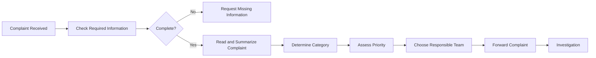
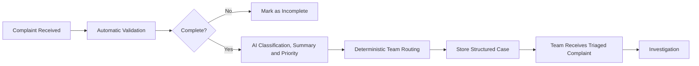

# Complaint Handling Process

## Before — Manual Complaint Triage

```mermaid
flowchart LR
    A[Complaint Received] --> B[Check Required Information]
    B --> C{Complete?}
    C -- No --> D[Request Missing Information]
    C -- Yes --> E[Read and Summarize Complaint]
    E --> F[Determine Category]
    F --> G[Assess Priority]
    G --> H[Choose Responsible Team]
    H --> I[Forward Complaint]
    I --> J[Investigation]
```

## After — AI-Assisted Complaint Triage

```mermaid
flowchart LR
    A[Complaint Received] --> B[Automatic Validation]
    B --> C{Complete?}
    C -- No --> D[Mark as Incomplete]
    C -- Yes --> E[AI Classification, Summary and Priority]
    E --> F[Deterministic Team Routing]
    F --> G[Store Structured Case]
    G --> H[Team Receives Triaged Complaint]
    H --> I[Investigation]
```